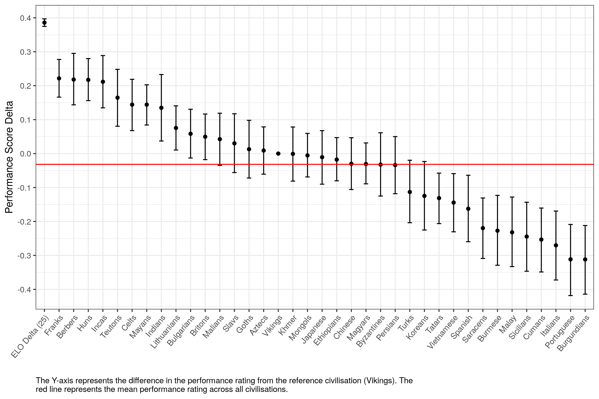

## Introduction

## Data

## Primary Results

To assess civilisation performance a Bradley-Terry model was fitted to the data. This model works by assuming that each civilisation has a latent (i.e. hidden/unknown) performance rating value $X_i$. The probability of civilisation $i$ beating civilisation $j$ in match $k$ is then calculated as:
$$\frac{1}{1+e^{-\lambda_{ijk}}}$$

Where:

- $\lambda_{ijk} = X_i - X_j + D_k$  
- $D_k$ is the difference in ELO rating between the two players in match $k$ divided by 25

Fitting this model to the available data results in the following plot:

Each point represents the estimated performance score for the corresponding civisation whilst the interval around the point represents the 95% credible interval, that is the interval in which there is a 95% chance that the true value exists within. The ELO Delta (25) point acts as a reference to show us the relative increase in performance score based upon a 25 point ELO difference between players. Clearly the impact of ELO massively outweighs the impact of civ choice. 

You may also notice that the performance score for Vikings is 0 and has no credible interval; this is due to how the maths works in that it requires a reference point to calculate all the other values off from. The choice of the reference is completely arbitrary and in this case I chose vikings because they are the last civisation alphabetically. This is to say that the performance scores you see in this graph represent the difference between that civilisations performance score and the Vikings performance score (though do not confuse this with thinking that these performance scores represent how the civilisations fare against the Vikings specifically!).

A natural question is then "ok but what do these numbers actually mean?". The best way to interpret them is to plug them back into the formula mentioned above. As an example lets take the Berbers who have a value of $0.24$ and the Turks who have a value of $-0.13$. Plugging these values into the above formula (assuming no ELO difference between the two players) gives us:
$$
\frac{1}{1+e^{-(0.24 - (-0.13))}} = \frac{1}{1+e^{-0.37}} = 0.591
$$

That is to say our model predicts that, with no difference in ELO between the two players, there is a 59.1% chance that the Berbers would beat the Turks in a 1v1 game on Arabia. The reference the following table provides a mapping from the difference in performance score to the expected win percentages:

| Difference in performance Score | Expected Win Percentage |
|:---:|:---:|
| 0.4 | 59.9%|
| 0.3 | 57.4%|
| 0.2 | 55.0%|
| 0.1 |  52.5%|
| 0.0 | 50.0%|
| -0.1 | 47.5%|
| -0.2 | 45.0%|
| -0.3 | 42.6%|
| -0.4 | 40.1%|

## Exploratory Results

## Frequently Asked Questions & Critiques

The following are common critiques and questions I see with regards to assessing civilisation win rate statistics along with my personal opinion / response towards them.

 

**1) You shouldn't include games with players below an ELO of X as the civilisation is nowhere near as important as other factors such as their overall understanding of the game and are likely making a ton of mistakes which don't reflect the civilisations overall ability / balance.**

I have two main objections to this argument, the first being more statistical in nature and the other being my personal feelings towards what it means to "balance" a game. 

So my first argument is that just because civilisation is less important that player skill doesn't mean that these games don't have value. Fundamentally the low ELO just means there is more noise in the data and that it's harder to pick out the signal. However this does NOT mean that the data is useless and we should disregard it. It just means we need more of it in order to identify the effects of the choice of civilisation.

My second argument is that I don't think it is sensible to just balance the game based upon the pros / perfect play of a civilisation; I strongly believe we should strive to ensure the game is balanced across all levels of gameplay. As an extreme example let's imagine we have a civ that completely dominates and is oppressive at ELOs <= 1500 but that the pros are easily able to counter with pixel perfect micro. Would you consider this balanced just because the pros are fine with it even though it breaks the game for the vast vast majority of players ? Alas I feel it is important to assess and strive for balance across all levels of play and not just at the top levels. 

 

**2) You need to account for players who play the vast majority of their games as a single civilisation**

This actually tends to be a non-issue due to the fact that games are balanced by their ELO rating which equates to their average in-game performance. Sure as a player plays more games with a specific civilisation they get good at using that civilisation and thus get better at using it. As a result their ELO rises until they are playing other players that can use their civilisations equally as well. The common argument is then that when the player who uses the same civilisation all the time uses a different civilisation they are super likely to lose and thus bias the results of the other civilisations. In reality though the fact that they only play a single civilisation all the time means that they contribute nearly no data for the other civilisations, and yes whilst this data might be biased, thus has no meaningful impact on the win rates of the other civilisations. 

  

